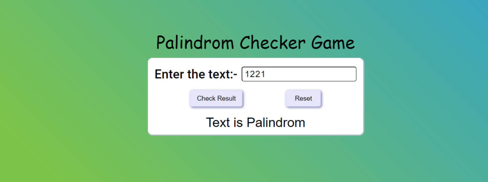

# Palindrom Checker Game

### I have made a Palindrom Checker using HTML, CSS, and JavaScript.

 

 
 

 
## Technology Used:-
  - ` HTML ` 
  - `CSS ` 
  - ` JS ` 
  
 Live Link :- [ Click here ](https://palindrom-checker.netlify.app/)

## It took almost 2 hour to complete.

### What I learned from this project?
 - How We take input from user.
 - Adding Elements through JavaScript.
 - Removing Elements through JavaScript.
 - Styling through JavaScript.
  
